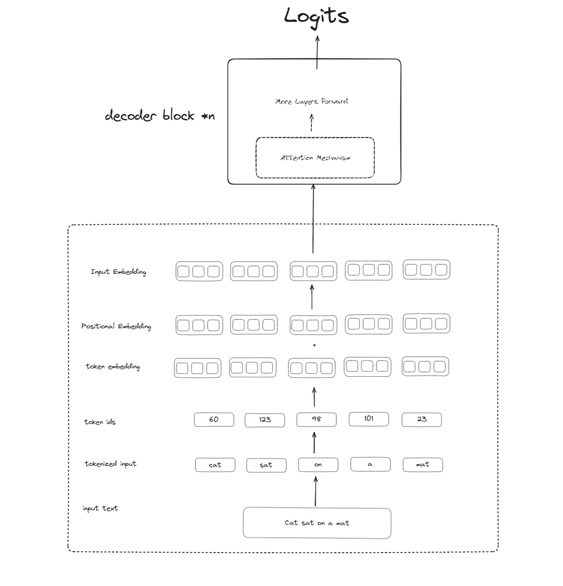

## Preprocessing text

Here text is prepared first to fed into the Decoder. The training data is prepared according to our **Model Configuration**.

- CONTEXT SIZE
- BATCH SIZE
- EMBEDDING SIZE
- OVERLAPPING OF SEQUENCES

## Steps

1. Tokenization of the input text
2. Convert the tokens into IDs
3. Get the embedding for each token
4. Add the token embedding with positional embedding to get the input embedding
5. Send the final `Input Embedding` to `**Decoder**`

